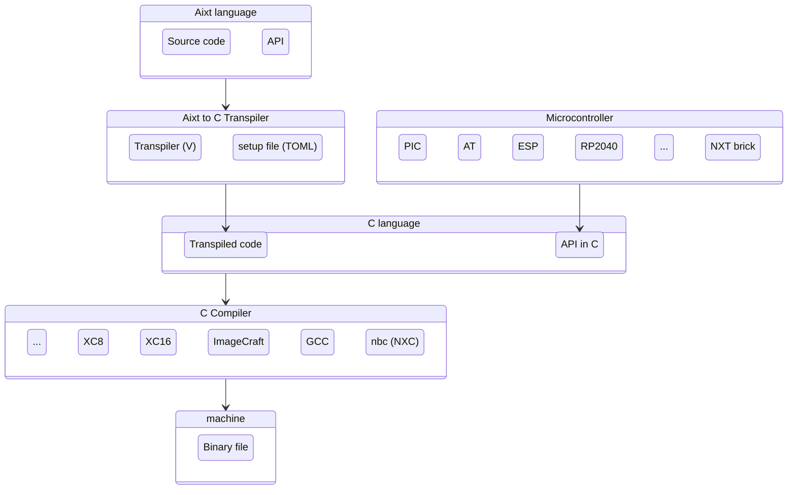

  
  
  

    <a href="#home">Home</a>
    <a href="#Docs">Docs</a>
    <a href="#contact">Contact</a>
    <a href="#about">About</a>
  

Aixt Project
===============

**El proyecto AIXT** ofrece una solución sencilla para la migración entre diferentes lenguajes de programación. Este proyecto nació como respuesta al avance tecnológico y a la diversidad de lenguajes de programación disponibles en la actualidad, que requieren la compilación de microcontroladores en distintos lenguajes. En este contexto, AIXT permite la compilación en el **lenguaje V**.

**AIXT** se desarrolló en 2022, basado en el **proyecto SOKAE**, estableciendo un puente entre la programación en Arduino y MicroPython. La estructura de programación de AIXT se compone de tres componentes principales: el lenguaje de **programación AIXT**, que se fundamenta en el **lenguaje V**; un lenguaje de programación diseñado para la conversión de **RUST a C**; y una API.

## Aixt to C Transpiler

The transpiler is written in [_V_](https://vlang.io/) using the _V's_ native self-compiler (a transpiler from _V_ to _C_). This is implemented in the folders `\aixt_build`, `\aixt_cgen` and `\aixt_pref`, and the main source code is the `aixt.v` file. It generates code for 3 different backends:
- **c**: for the microcontroller native C compiler
- **nxc**: for the NXC compiler (LEGO Mindstorms NXT)
- **arduino**: for the Arduino IDE
